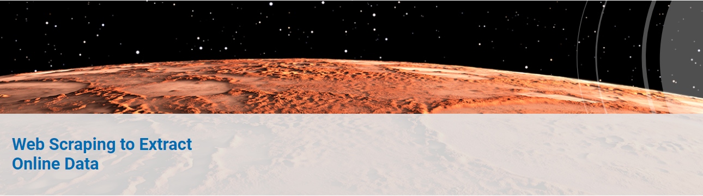
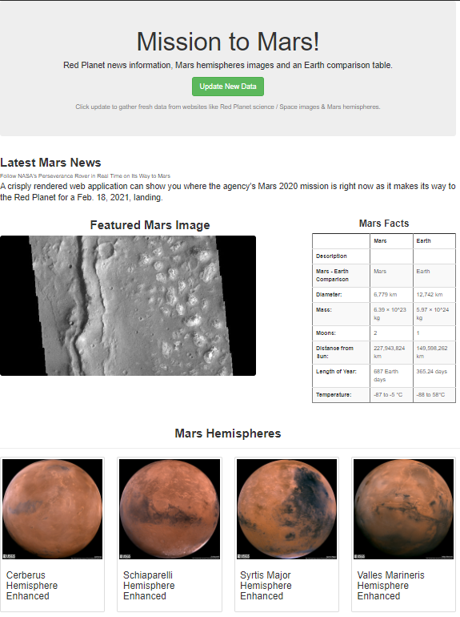
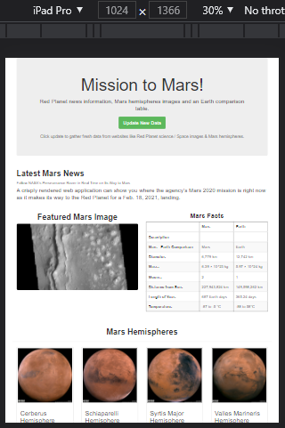
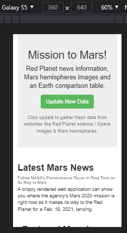

# Mission-to-Mars

## Background
Robin's web app is looking good and functioning well, but she wants to add more polish to it. She had been admiring images of Mars’s hemispheres online and realized that the site is scraping-friendly. She would like to adjust the current web app to include all four of the hemisphere images. To do this, you’ll use BeautifulSoup and Splinter to scrape full-resolution images of Mars’s hemispheres and the titles of those images, store the scraped data on a Mongo database, use a web application to display the data, and alter the design of the web app to accommodate these images.

### This new assignment consists of three technical analyses:

- Deliverable 1: Scrape Full-Resolution Mars Hemisphere Images and Titles

      Using BeautifulSoup and Splinter, you’ll scrape full-resolution images of Mars’s hemispheres and the titles of those images.

- Deliverable 2: Update the Web App with Mars Hemisphere Images and Titles

      Using Python and HTML to add to the initial pythoncode, update the Mongo database, and modify the index.html file so the webpage contains all the information collected in as well as the full-resolution image and title for each hemisphere image.
      
- Deliverable 3: Add Bootstrap 3 Components

